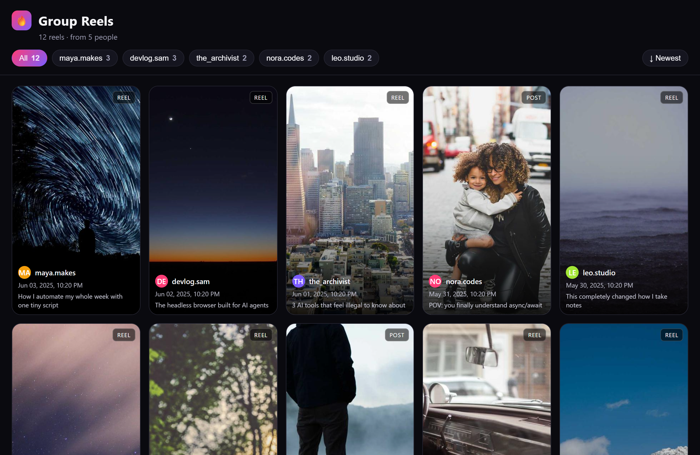

<sub>**English** · [Português 🇧🇷](README.pt-BR.md)</sub>

# 🎬 Instagram Reels Gallery

> Every Reel your friends dumped in the group chat, turned into one beautiful, browsable
> wall. Extract the Reels shared in an Instagram **DM group** and build a static gallery
> site, filter by who shared, sort by date, click to open.

No username/password: it uses **your own session cookie**. Output is plain static files,
so you can open them locally or host them anywhere.




> *Sample gallery with placeholder data, filter chips per person, newest/oldest toggle,
> 9:16 cards, click to open on Instagram.*

---

## 🚀 Features

- **Reads a DM group**: pulls every Reel/post shared in the conversation.
- **Knows who shared what**: each card shows the friend who posted it; filter by person.
- **Self-contained site**: thumbnails are downloaded locally (Instagram CDN links expire),
  so the gallery keeps working forever, even offline via `file://`.
- **Cookie auth**: no password; uses your `sessionid`.
- **One-command deploy**: optional Netlify upload, or drop it on any static host.

---

## 📦 Requirements

```bash
pip install instagrapi requests
```

Plus a logged-in Instagram **`sessionid`** (see below).

---

## 🔑 Get your sessionid

1. Log in to Instagram in your browser.
2. `F12` → **Application** → **Cookies** → `https://www.instagram.com` → copy the value of
   the **`sessionid`** cookie.
3. Paste it (just the value, one line) into a file named `.sessionid` in this folder, or
   set the `IG_SESSIONID` env var.

> ⚠️ The `sessionid` grants full access to your account. Treat it like a password. It's
> git-ignored and never leaves your machine. To revoke, just log that session out on
> Instagram.

---

## ▶️ Usage

```bash
# 1) find your group's THREAD_ID
python extract.py list
#    (or search by name)
python find_thread.py "the squad"

# 2) pull the reels  ->  reels.json
python extract.py pull <THREAD_ID>            # add --limit N to cap it

# 3) build the gallery  ->  site/index.html
python build_site.py reels.json site "The Squad's Reels" 🔥

# 4) (optional) deploy to Netlify
NETLIFY_AUTH_TOKEN=xxxxx python deploy_netlify.py site the-squad-reels
```

Open `site/index.html` in your browser. To refresh with new reels, repeat steps 2–3.

> The API `thread_id` is **not** the id in the web URL (`/direct/t/<id>/`). Use
> `extract.py list` or `find_thread.py` to get the real one.

---

## ⚙️ How it works

| Script | Does |
|--------|------|
| `extract.py list` | lists your DM threads + their `THREAD_ID` (groups first) |
| `extract.py pull <id>` | walks the conversation → `reels.json` (code, owner, who shared, date, thumb) |
| `find_thread.py "name"` | finds a thread id by name/@username |
| `build_site.py` | downloads thumbnails + writes the static `site/` |
| `deploy_netlify.py` | zips & deploys `site/` via the Netlify REST API |

It handles Instagram's current share format (`xma_clip` = reel, `xma_media_share` = post)
as well as older structured shares, deduping by reel code.

---

## 🤖 Use it as a Claude Code skill

```bash
git clone https://github.com/pedroccm/instagram-reels-gallery.git \
  ~/.claude/skills/instagram-reels-gallery
```

Then say *"build a gallery from the reels in my group 'the squad'"*.

---

## 📝 Notes & limits

- Uses Instagram's **private API** (instagrapi), technically against the ToS. Block risk
  exists but is lower with a cookie than with user/password. Keep the delays in place.
- `reels.json` and `site/` hold private group content and are **git-ignored** by default.
- Story shares are skipped (they're ephemeral).

---

## 📄 License

MIT, see [LICENSE](LICENSE).
